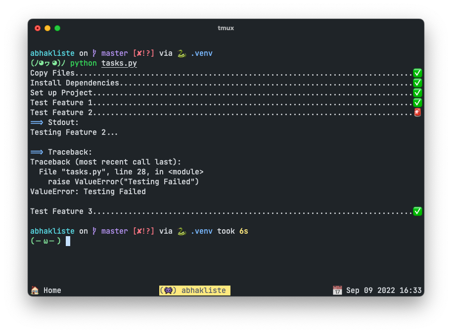

# Abhakliste

Abhakliste is a minimal task runner that prints a list of tasks and their status.
It runs a collection of dependent task which can be shell commands or python functions in sequence
and checks for error. Even if one task fails, it continues to run the rest of the tasks.
The goal of this project is to provide a minimal task runner with a low overhead API.



## Installation

Install the project with `pip`

```bash
pip install abhakliste
```

## Features

- Low Overhead Task Runner
- Visual summary of task results
- Written in pure python (no modules)
- Supports Python 3.8+

## Quick Usage

```python
from time import sleep
from abhakliste import Abhakliste

# set up runner
abhaker = Abhakliste()

# run task in abhaker context
with abhaker.run_context(desc="Run ls"):
    sleep(1)
```
